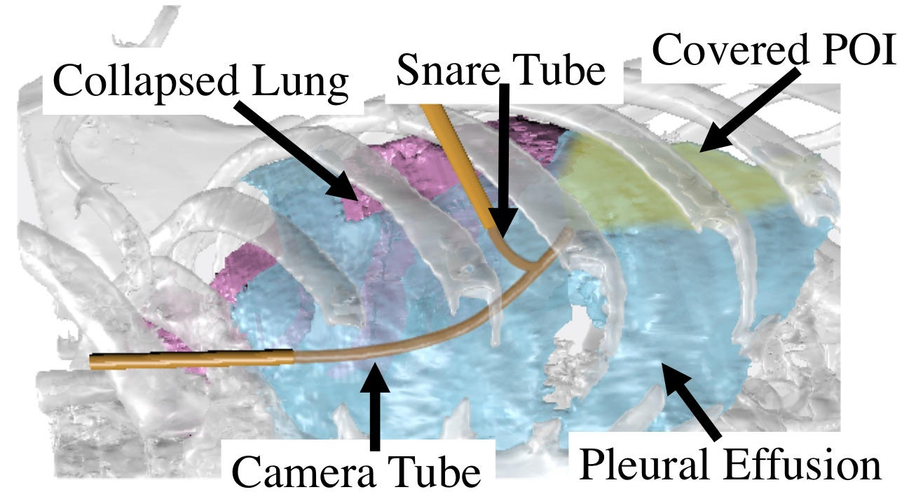
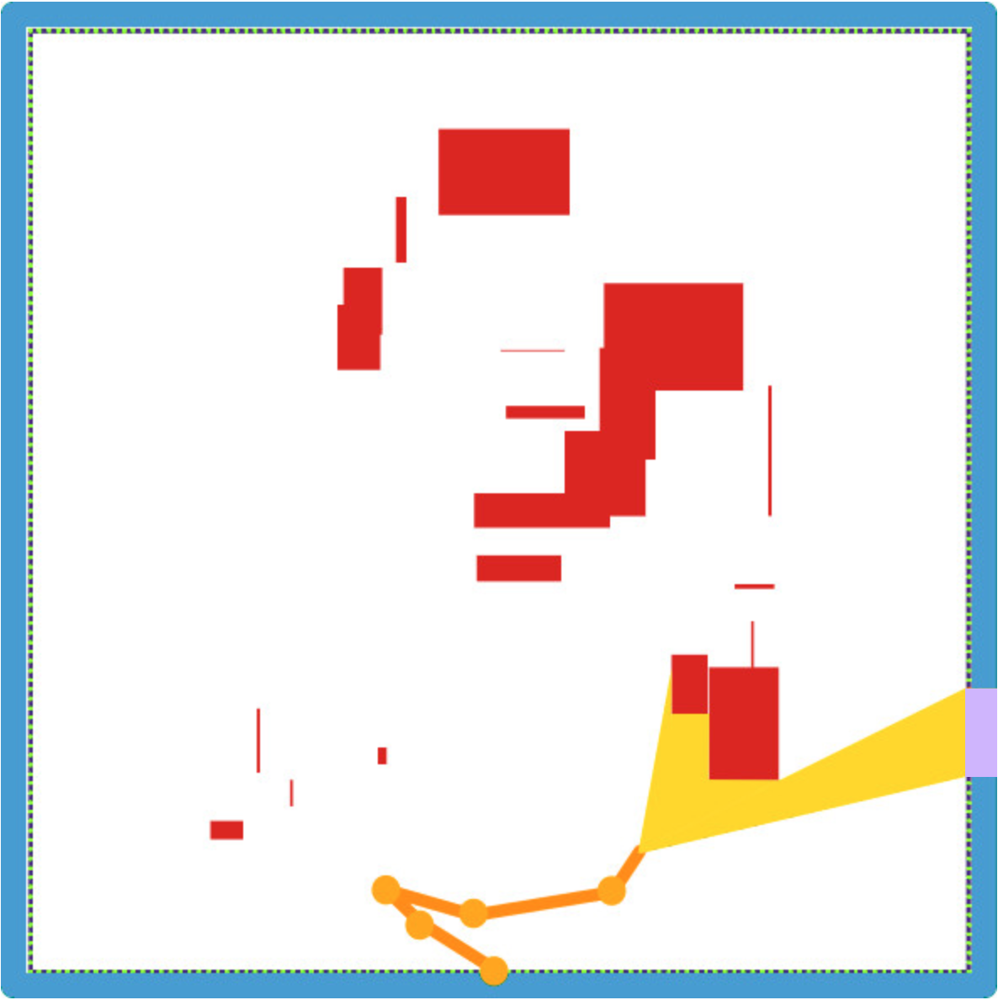
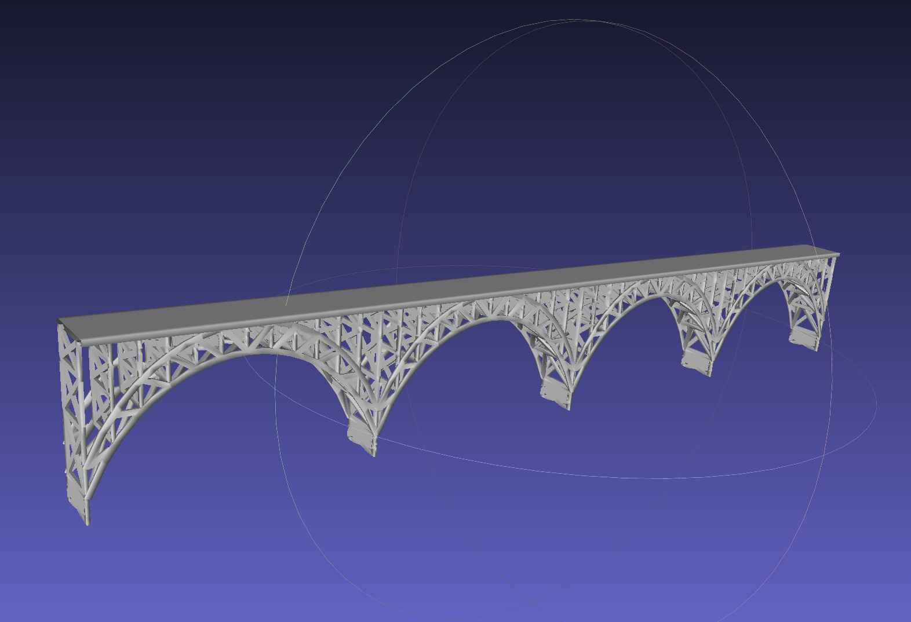

# IRIS (Incremental Random Inspection-roadmap Search)

#### Update 05/20/2021

Extended code for IEEE International Conference on Robotics and Automation (ICRA) 2021 paper *Computationally-Efficient Roadmap-based Inspection Planning via Incremental Lazy Search*. [[Paper](https://ieeexplore.ieee.org/document/9561653)][[arXiv](https://arxiv.org/pdf/2103.13573.pdf)]

#### Original

Code for Robotics: Science and Systems (RSS) 2019 paper *Toward Asymptotically-Optimal Inspection Planning via Efficient Near-Optimal Graph Search*. [[Paper](http://www.roboticsproceedings.org/rss15/p57.html)][[arXiv](https://arxiv.org/pdf/1907.00506.pdf)]

## Inspection planning

Inspection planning, the task of planning motions that allow a robot to inspect a set of points of interest (POI), has applications in domains such as industrial, field, and medical robotics. Naively-computed inspection plans may enable inspection of only a subset of the POI and may require motion plans orders of magnitude longer than an optimal plan, and hence may be undesirable or infeasible due to battery or time constraints. In medical applications, physicians may want to maximize the number of POI inspected for diagnostic purposes. Additionally, the procedure should be completed as fast as is safely possible to reduce costs and improve patient outcomes, especially if the patient is under anesthesia during the procedure. For example, a robot assisting in the diagnosis of the cause of a pleural effusion (a serious medical condition which causes the collapse of a patient’s lung) will need to visually inspect the surface of the collapsed lung and chest wall inside the body in as short a time as possible. Our goal is to compute high-quality inspection plans that maximize the number of POI inspected, and of the motion plans that inspect those POI we compute a shortest plan that is kinematically feasible and avoids obstacles.

## Requirements

* [GCC(for Linux)](https://gcc.gnu.org/) - v7.4
* [Boost](https://www.boost.org/) - v1.68.0
* [CMake](https://cmake.org/) - v3.8
* [Eigen3](http://eigen.tuxfamily.org/index.php?title=Main_Page) - v3.3.4
* [OMPL](https://ompl.kavrakilab.org/) - the Open Motion Planning Library v1.5.0

## License

Unless otherwise specified in the file, BSD 3-Clause License applies.

## Installation

1. First clone code to your local repository:

    ```
    git clone git@github.com:UNC-Robotics/IRIS.git [{path to your local repository}]
    git submodule update --init --recursive
    ```

2. Download data from [google drive](https://drive.google.com/file/d/19DGtog4D4hAgwFu1bV_ct0h_n-G4BR1Z/view?usp=sharing) to your local respository, uncompress.

3. Install all dependencies. If you install dependencies to your specified directories, you will need to provide the information when compiling.

4. Compile:

    ```
    cd {path to your local repository}
    mkdir build
    cd build
    cmake ..
    make
    ```

5. Tested environment:

    * Ubuntu 18.04 (gcc 7.4.0)
    * Ubuntu 16.04 (gcc 7.4.0)
    * Ubuntu 14.04 (gcc 7.2.0)
    * macOS Mojave Version 10.14.6 (clang-1001.0.46.4)
    * macOS Catalina Version 10.15 (clang-1100.0.33.8)

## Usage

1. Specify which scenario to use in ```include/global_common.h```:
    
    ```
    #define USE_CRISP 0
    #define USE_PLANAR 0
    ```

    If ```USE_CRISP``` is set to 1, then the CRISP robot is used.
    
    If ```USE_CRISP``` is set to 0 and ```USE_PLANAR``` is set to 1, then the planar robot is used.

    If both ```USE_CRISP``` and ```USE_PLANAR``` are set to 0, then the drone robot is used.

    *Important for macbook users:*

    OMPL uses C++17 deprecated functions, and clang reports errors when you set C++ standard to 17.
    A simple way to solve this is to disable drone robot (which is done by the current cmake files), all you need to do is avoid setting both ```USE_CRISP``` and ```USE_PLANAR``` to 0.
    If you still want to use the drone robot, please replace ```{OMPL_Source}/src/ompl/datastructures/NearestNeighborsGNAT.h``` with the one in external folder, rebuild and reinstall OMPL, finally change line 23 in root ```CMakeLists.txt``` to ```set(USE_C++17 1)```.

2. Build a graph (roadmap):

    ```
    cd {path to your local repository}/build
    ./app/build_graph seed num_vertex file_to_write 
    ```

    When constructing the roadmap, we now allow rejection sampling to favor samples that increase inspection coverage. Set ```REJECT_SAMPLING``` (in ```include/global_common.h```) to 1 to enable this feature.

2. Search a graph:

    ```
    cd {path to your local repository}/build
    ./app/search_graph file_to_read initial_p initial_eps tightening_rate laziness_mode successor_mode batching_ratio file_to_write
    ```

    Here, four different laziness modes are provided:

    * 0 -- No lazy computation
    * 1 -- Lazy SP (complete lazy)
    * 2 -- Lazy A* modified (validate when subsuming for the first time, final method in the paper)
    * 3 -- Lazy A* (validate only when popped from OPEN list, performance worse than 2, keep for reference)

    There are also three successor modes provided:

    * 0 -- direct neighboring successors on the roadmap (default, preferred)
    * 1 -- First neighbor that increases inspection coverage (keep for reference)
    * 2 -- first neighbor that increases inspection coverage and there's no other node increasing the coverage along the shortest path from its parent (keep for reference)

    In ```include/global_common.h```, there are also additional macros to enable different features, namely ```USE_NODE_REUSE```, ```KEEP_SUBSUMING_HISTORY```, and ```SAVE_PREDECESSOR```. ```USE_NODE_REUSE``` enables reusing search efforts from previous search iteration. ```KEEP_SUBSUMING_HISTORY``` enables saving detailed information about subsumed node, which is essential for lazy edge validation (laziness mode 3) and search effort reusing. ```SAVE_PREDECESSOR``` is an additional optimization for subusming history keeping, that saves memory footprint by saving the predecessor of the subsumed node instead of saving the subsumed node directly.

## Robot Background

This repository implements an inspection planning algorithm and demonstrates its functionality on three different robots.

1. The CRISP robot

     The first one is a continuum, reconfigurable, parallel robot designed for incisionless surgery (i.e., CRISP robot). This robot concept combines the flexibility and minimally invasive access of continuum robots with the stiffness of parallel robots and the ability of reconfigurable robots to adjust for changing task requirements. CRISP robots consist of multiple elastic members (typically flexible needles made of materials such as superelastic Nitinol) that are connected inside a body cavity using wire snare loops. The needles form a flexible parallel structure that is controlled from outside the body with robot manipulators. Previous research on CRISP robots includes mechanics-based modeling [1], shape sensing and estimation [2], motion planning [3], and design optimization [4]. 


    [1] A. W. Mahoney, P. L. Anderson, P. J. Swaney, F. Maldonado, and R. J. Webster, "Reconfigurable Parallel Continuum Robots for Incisionless Surgery," 2016 IEEE/RSJ International Conference on Intelligent Robots and Systems (IROS), Daejeon, 2016, pp. 4330-4336.
    doi: 10.1109/IROS.2016.7759637

    [2] P. L. Anderson, A. W. Mahoney, and R. J. Webster, "Continuum Reconfigurable Parallel Robots for Surgery: Shape Sensing and State Estimation With Uncertainty," in IEEE Robotics and Automation Letters, vol. 2, no. 3, pp. 1617-1624, July 2017.
    doi: 10.1109/LRA.2017.2678606


    [3] A. Kuntz, A. W. Mahoney, N. E. Peckman, P. L. Anderson, F. Maldonado, R. J. Webster, and R. Alterovitz, "Motion Planning for Continuum Reconfigurable Incisionless Surgical Parallel Robots," 2017 IEEE/RSJ International Conference on Intelligent Robots and Systems (IROS), Vancouver, BC, 2017, pp. 6463-6469.
    doi: 10.1109/IROS.2017.8206553


    [4] A. Kuntz, C. Bowen, C. Baykal, A. W. Mahoney, P. L. Anderson, F. Maldonado, R. J. Webster, and R. Alterovitz, "Kinematic Design Optimization of a Parallel Surgical Robot to Maximize Anatomical Visibility via Motion Planning," 2018 IEEE International Conference on Robotics and Automation (ICRA), Brisbane, QLD, 2018, pp. 926-933.
    doi: 10.1109/ICRA.2018.8461135

    

2. The planar-link-camera robot

    The second one is a multi-link planar manipulator with a camera as end effector.

    

3. The quadroter

    The third one is a unmanned aerial vehicle (UAV), a quadroter more specifically. It tries to inspect a bridge structure provided as a mesh.

    


## Citation

If you use this source code, please cite the following papers accordingly:
```
@INPROCEEDINGS{Fu2019_RSS,
    AUTHOR    = {Mengyu Fu AND Alan Kuntz AND Oren Salzman AND Ron Alterovitz},
    TITLE     = {Toward Asymptotically-Optimal Inspection Planning Via Efficient Near-Optimal Graph Search},
    BOOKTITLE = {Proceedings of Robotics: Science and Systems},
    YEAR      = {2019},
    ADDRESS   = {FreiburgimBreisgau, Germany},
    MONTH     = {June},
    DOI       = {10.15607/RSS.2019.XV.057}
}

@INPROCEEDINGS{Fu2021_ICRA,
    author={Fu, Mengyu and Salzman, Oren and Alterovitz, Ron},
    booktitle={2021 IEEE International Conference on Robotics and Automation (ICRA)},
    title={Computationally-Efficient Roadmap-based Inspection Planning via Incremental Lazy Search},
    year={2021},
    volume={},
    number={},
    pages={7449-7456},
    doi={10.1109/ICRA48506.2021.9561653}
}
```
